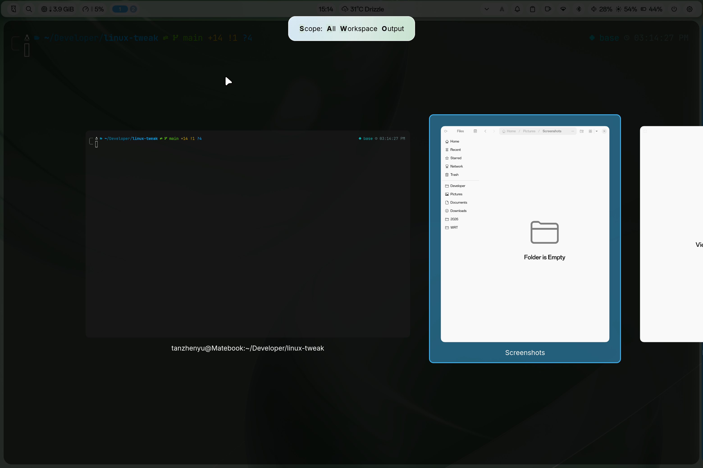

# # 自用的Linux系统及APP优化美化

我目前使用CachyOS系统，Niri窗口合成器，登录和桌面主题使用Noctalia。

我希望尽可能地减少去折腾Linux，而把它当成生产力工具去使用，所以能用现成的就用现成的。

但是我使用的系统希望整体设计是和谐美观的，简单优雅，能高效工作就行。

## 常用配置

- Niri桌面（虽然有人觉得它不是桌面）默认配置文件的修改
- Alacritty终端的简单配置
- Vim编辑器的简单配置
- 系统字体配置文件

## 微信

微信在打开文件和另存为文件的时候，使用的是Qt自带文件对话框，和整个系统使用xdg-desktop-portal也是不一致的，所以我添加了一个脚本用于实现打开对话框的一致。

### 原理

启动一个假的Deepin文件对话框（因为Linux版本的微信默认会去调用Deepin文件对话框）D-Bus服务，然后把微信请求转给GNOME的xdg-desktop-portal。

### 具体操作

- 安装必要的库

```Shell
sudo pacman -S --needed python-dbus python-gobject xdg-desktop-portal xdg-desktop-portal-gnome dbus
```

- 安装脚本

```Shell
install -Dm755 ./wechat-portal-tweak/wechat-deepin-dialog-shim  ~/.local/bin/wechat-deepin-dialog-shim

install -Dm755 ./wechat-portal-tweak/wechat-gnome-dialog ~/.local/bin/wechat-gnome-dialog
```

- 修改微信Desktop启动文件

```Shell
sed -i 's|^Exec=.*|Exec=/home/tanzhenyu/.local/bin/wechat-gnome-dialog %U|' \
  ~/.local/share/applications/wechat.desktop

update-desktop-database ~/.local/share/applications 2>/dev/null || true
```

## Niri

Niri在Alt+Tab切换窗口，截图的时候等都会出现一个提示信息，这个提示信息Overlay的样式是在源码中写死的，和我使用的Nocatalia主题很不搭。所以我写了一个脚本用于修改源码，自定义了一个类似微软Mica材质的样式，修改字体为Inter（参考`niri-overlay-tweak`）

目前，我使用过程中只发现了快捷键提示信息，窗口切换的Scope提示信息，以及截图的提示信息这三个场景，所以目前暂时修改了这三个地方使用一个蓝绿色渐变的模拟Mica材质的背景提示Overlay。



## Codex

平常使用Codex比较多，但是使用`paru`安装的Codex桌面客户端右上角的三个按钮（最小化、还原和最大化）的背景和标题栏颜色不一致，这就很别扭。

使用`make-codex-frameless.sh`脚本可以重新编译安装一个不带右上角按钮的版本。如果使用平铺窗口管理器的，可以这样操作。但是使用传统桌面环境的，这样操作以后就无法用鼠标进行最大化和最小化了。
